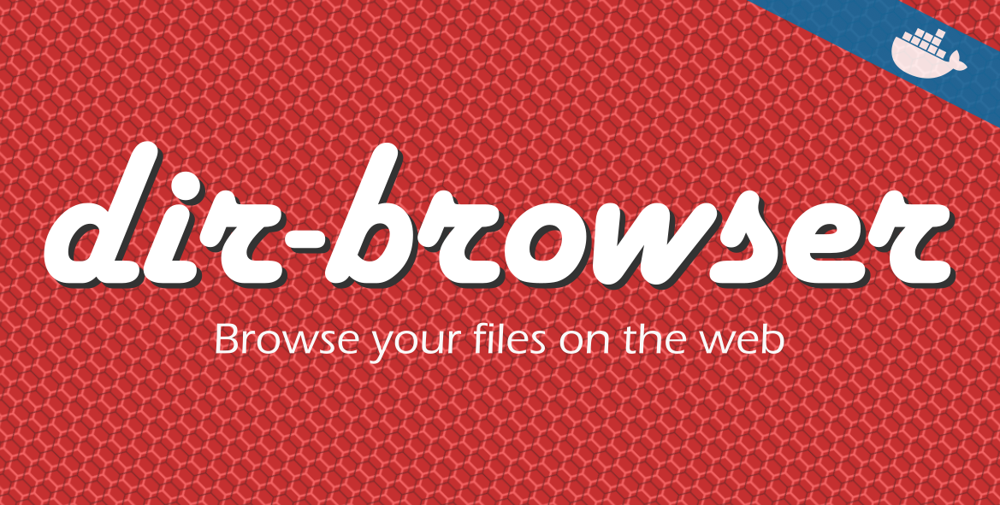
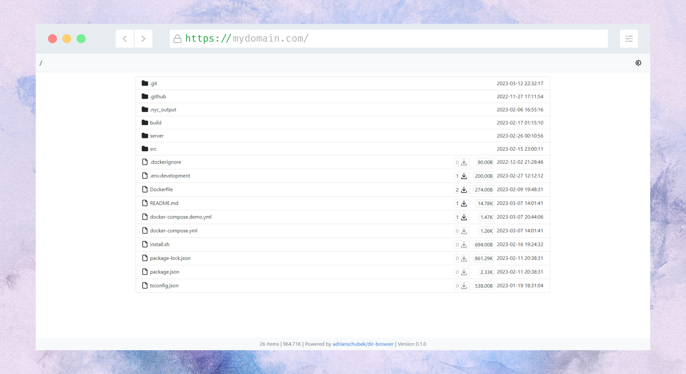
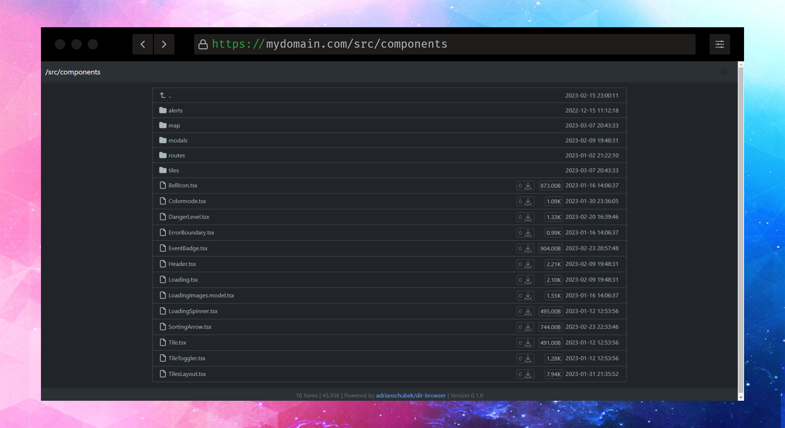

<div align="center">

<!-- # Directory Browser
_Easiest way to browse your files and folders on the web._
 -->

[](https://dir.adriansoftware.de)

<!--  -->

<!--


-->
</div>


<h2 align="center">

  Visita [dir.adriansoftware.de](https://dir.adriansoftware.de) para ver la documentación y más! 

</h2>

<!--  -->

<!--  -->


## Demostración

https://dir-demo.adriansoftware.de

## Características
- **Contador de descargas** para todos los archivos
- Seguro por defecto. Acceso de **solo lectura**
- Servicio de archivos **extremadamente rápido** mediante **nginx**
- Soporte para renderizado de markdown de **README**
- **API JSON** para acceso programático
- **Descarga en lote** de archivos y carpetas en un archivo zip
- Verificación de **integridad de archivos** con **hashes**
- **Descripciones personalizadas** y **etiquetas** para archivos y carpetas
- **Búsqueda** y **ordenamiento** integrados
- Protección con **contraseña**
- **Ocultar** archivos y carpetas
- Modo claro y modo **oscuro**
- **Iconos** de archivos
- Muchos **temas** disponibles
- **URLs limpias** equivalentes a las rutas del sistema de archivos
- **Bajo consumo de memoria** (~10MB)
- Configuración sencilla usando una única imagen de **Docker**
- Diseño **responsivo** para dispositivos móviles y escritorio
- Fácilmente configurable mediante **variables de entorno**
- Estadísticas de archivos como fechas de modificación y tamaños
- Soporte para JS y CSS personalizados
- Resaltar archivos actualizados recientemente
- Seguimiento del tiempo de las solicitudes
- Soporte para **arm64**

## Inicio rápido (Docker)

Sirva una carpeta local en modo solo lectura en http://localhost:8080:

```bash
docker run -d \
  --name dir-browser \
  -p 8080:80 \
  -v /my/local/folder:/var/www/html/public:ro \
  -v rdb:/var/lib/redis/ \
  adrianschubek/dir-browser:latest
```

Establezca `PUBLIC_ROOT` en una ruta dentro de `/var/www/html/public` cuando la raíz del contenido montado esté anidada, por ejemplo
`-e PUBLIC_ROOT=/var/www/html/public/link` para un volumen compartido git-sync.

## Documentación

- Documentación: https://dir.adriansoftware.de
- Demostración: https://dir-demo.adriansoftware.de
