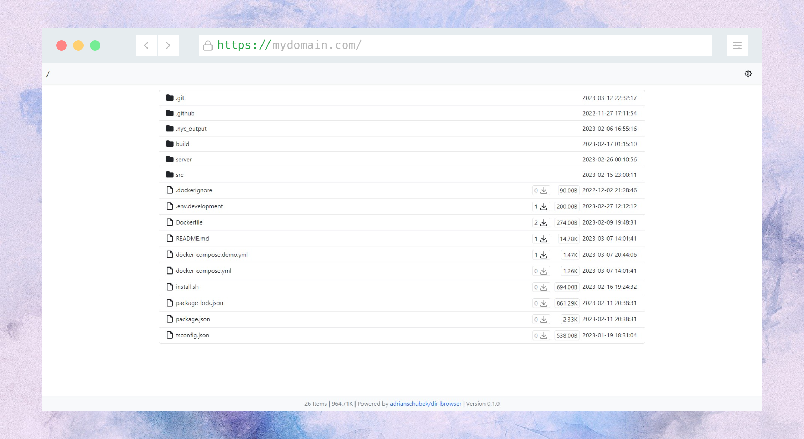
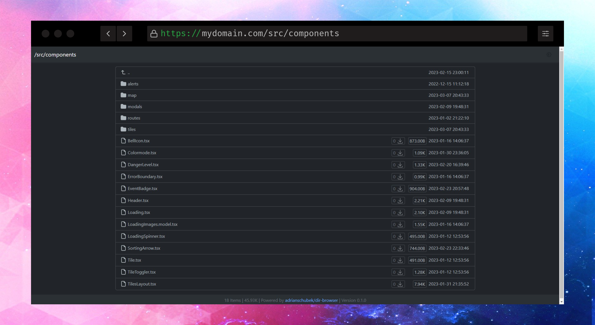

<div align="center">





</div>

## Demo

https://bp.adriansoftware.de

## Features
- **Download count** for all files
- Secure by default. **Read-only** access
- Extremly **fast** file serving through **nginx**
- **Low memory** footprint (~10MB)
- Light and **Darkmode**
- Easy setup using single **Docker** image
- **Responsive** design for mobile devices and desktop
- File stats like modification dates, sizes and hashes
- **arm64** support
<!-- - **Password protection** for files and folders -->

## Installation

Use the image from [Docker Hub](https://hub.docker.com/r/adrianschubek/dir-browser/tags).


```
docker run -d -p 8080:80 -v /my/local/folder:/var/www/html/public:ro -v redissave:/var/lib/redis/ -it adrianschubek/dir-browser
```

where `/my/local/folder` is the local folder you want to serve and `8080` is the port you want to use.

Access the directory browser at `http://localhost:8080`.

## Deployment

For production use, you should use a reverse proxy like [nginx](https://nginx.org/), [traefik](https://traefik.io/traefik/) or [Apache](https://httpd.apache.org/) to serve the directory browser. This has many advantages, like SSL support, caching and more. 

Here are some configurations for different reverse proxies:

<details>
<summary>Apache</summary>

```apache
<VirtualHost *:80>
  ServerName domain.tld

  ProxyPass / http://127.0.0.1:8080/
  ProxyPassReverse / http://127.0.0.1:8080/
</VirtualHost>

<VirtualHost *:443>
  ServerName domain.tld

  ProxyPass / http://127.0.0.1:8080/
  ProxyPassReverse / http://127.0.0.1:8080/

  SSLEngine on
  SSLCertificateFile cert.pem
  SSLCertificateKeyFile cert.key
</VirtualHost>
```

</details>

<details>
<summary>nginx</summary>
TODO
</details>

<details>
<summary>traefik</summary>
TODO
</details>

Also make sure to run the container with the `--restart always` flag to ensure that the container is always running in case of a host reboot.

## Roadmap
- [ ] Password protection per file/folder
- [ ] File hashes
- [ ] i18n: more languages

## Development

1. Clone the repository
2. `docker run --rm --name dir -p 8080:80 -v /some/local/folder:/var/www/html/public:ro -v redissave:/var/lib/redis/  -it $(docker build -q -f Dockerfile .)`

<!-- Directory Browser / Lister drop-in

docker run --rm --name dir -p 8080:80 -v /home/adrian/Uni/BP/frontend:/var/www/html/public:ro  -it $(docker build -q .)
docker run --restart always --rm --name dir -p 8080:80 -v /home/adrian/Uni/BP/frontend:/var/www/html/public:ro  -it adrianschubek/dir-browser

docker run --rm --name dir -p 8080:80 -v /home/adrian/Uni/BP/frontend:/var/www/html/public:ro -v redissave:/var/lib/redis/  -it $(docker build -q -f Dockerfile .) -->
