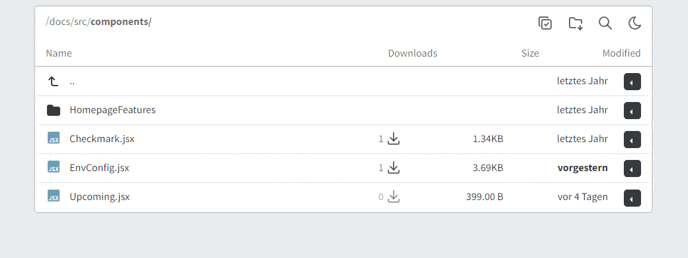
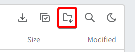

# Batch Downloads

The batch download feature allows you to download multiple files at once in a zip file.

The ZIP archive is streamed to the client while it is being generated. This keeps memory usage low (no in-memory ZIP build) and usually reduces CPU work compared to buffering/re-compressing large outputs.

Enable the multi selection mode by clicking the checkbox in the top right corner of the file list. You can then select multiple files by clicking on the files.

Or download the current folder.

:::info
Selecting a folder will also recursively select all files and folders inside it if the user has permission to access them (see [Password Protection](./password.mdx)).
:::

import EnvConfig from "@site/src/components/EnvConfig";

<EnvConfig name="BATCH_DOWNLOAD|BATCH_TYPE|BATCH_ZIP_COMPRESS_ALGO|BATCH_MAX_TOTAL_SIZE|BATCH_MAX_FILE_SIZE|BATCH_MIN_SYSTEM_FREE_DISK" init="true|zip|STORE|500000|500000|500" values="true,false|zip|STORE,DEFLATE|<Megabyte>|<Megabyte>|<Megabyte>" versions="3.3|3.3|3.3|3.3|3.3|3.3" desc="||Compression method for ZIP streaming. Use STORE for best performance; any non-STORE value effectively falls back to DEFLATE.|Total zip file size limit (MB). Streaming avoids building the whole ZIP in memory, but limits are still recommended.|Per-file size limit (MB). Streaming avoids building the whole ZIP in memory, but limits are still recommended.|Minimum system disk space to keep free at all times. If creating a zip file would violate this constraint, it will be canceled." />
