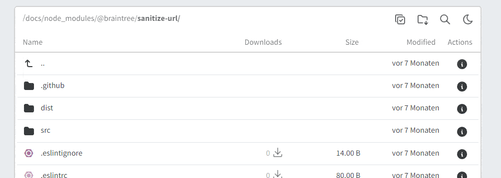

# API

### Folder listing

Add `?ls` to a folder URL to get a JSON response of the folder content.

https://dir-demo.adriansoftware.de/?ls

### File info

Add `?info` to a file URL to get a JSON response of the file info. A password is required if the file is inside a password protected folder.

https://dir-demo.adriansoftware.de/Dockerfile?info

import EnvConfig from "@site/src/components/EnvConfig";

<EnvConfig name="API" init="true" values="true,false" versions="3.1" />
