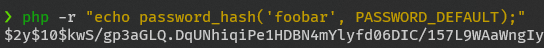
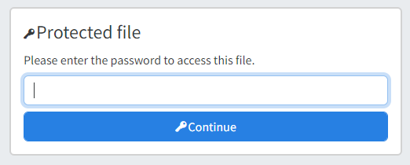

import Image from "@theme/IdealImage";

# Password Protection

Folders can be protected with a password using a `.access.json` file.
Access control applies recursively to all children.
It is also possible to protect the entire dir-browser instance with a global password.

Both folder passwords and a global password can be used at the same time.

:::info Backward Compatibility
Before v4 individual files could be password protected using `.dbmeta.json`. This is no longer supported.
:::

## Folder password

Place a `.access.json` file in a folder to protect that folder and (optionally) its subfolders.

When a folder is protected, its directory listing and all file downloads inside it require the correct password.

### Definition

Create a `.access.json` file in the folder you want to protect.

Supported fields:

- `password_hash` (string): A PHP `password_hash(...)` value.
- `password_raw` (string): A plaintext password (not recommended, but supported).
- `hidden` (boolean): Hide the folder completely (not listed; direct access behaves like 404).
- `inherit` (boolean): If `true`, this config applies to subfolders. Subfolder `.access.json` overrides parent configs.

#### Hash

The hash should be generated using PHP's [`password_hash`](https://www.php.net/manual/en/function.password-hash.php) function.
You can generate one using the following command or use an online generator.
```bash
php -r "echo password_hash('foobar', PASSWORD_ARGON2ID);"
```




```json title="/examples/foobar/.access.json"
{
  "password_hash": "$2y$10$kwS/gp3aGLQ.DqUNhiqiPe1HDBN4mYlyfd06DIC/157L9WAaWngIy",
  "hidden": false,
  "inherit": true
}
```

#### Plaintext

```json title="/examples/foobar/.access.json"
{
  "password_raw": "foobar",
  "inherit": true
}
```

Prefer `password_hash` over `password_raw` for better security.

### Access

#### Via UI

When accessing a protected folder or file, you will be prompted to enter the password.
After unlocking, dir-browser stores the key in a `dir_browser_key` cookie (so it does not need to live in the URL).

{/* <Image img={require("@site/static/img/pw2.png")} /> */}


#### Via URL / API

For programmatic access, send the key via the `X-Key` header:

`X-Key: foobar`

```
 curl -H "X-Key: foobar" https://dir-demo.adriansoftware.de/examples/foo%20%20%20bar/
```

:::info
Legacy support: `?key=...` is still accepted, but dir-browser will redirect to a clean URL after setting the cookie.

```
curl -X POST https://dir-demo.adriansoftware.de/examples/foo%20%20%20bar/ -d "key=foobar"
```
:::

#### Logout

To clear the stored password key, use the `?logout` endpoint on the protected folder:

```
curl https://dir-demo.adriansoftware.de/examples/foo%20%20%20bar/?logout
```

### Inheritance

When evaluating access, dir-browser checks the current folder `.access.json` and all parent folders.
Parent configs only apply to subfolders when `inherit: true`. Subfolder configs override parent configs.

## Global password

The entire dir-browser instance can be protected with a global password using [basic auth](https://en.wikipedia.org/wiki/Basic_access_authentication). 

### Definition

import EnvConfig from '@site/src/components/EnvConfig';

<EnvConfig name="PASSWORD_USER|PASSWORD_RAW|PASSWORD_HASH|AUTH_COOKIE_LIFETIME|AUTH_COOKIE_HTTPONLY" init="<empty>|<empty>|<empty>|604800|true" values="<string>|<string>|<hash>|seconds|bool" desc="Username|Plaintext password|Hash of a password. See definition above.|Lifetime of authentication cookie|Cookie HttpOnly flag" versions="3.3|3.3|3.3|4.2|4.2"/>

:::warning
If `PASSWORD_USER` is set then either `PASSWORD_RAW` or `PASSWORD_HASH` is required.
:::

{/* :::info
Support for LDAP, OAuth, and other authentication methods is planned.
:::

support Basic Auth */}

### Access

#### Via UI

When accessing the dir-browser, your browser will prompt you to enter a username and password.

#### GET request

Specify the `username:password` pair base64 encoded in the `Authorization` header.

For example if the username is `admin` and the password is `foobar` then Base64 encode `admin:foobar` to `YWRtaW46Zm9vYmFy`.

```
curl https://dir-demo.adriansoftware.de/examples/burger.jpg -H "Authorization: Basic YWRtaW46Zm9vYmFy"
```

#### POST request

Or as part of a POST request

```
curl -X POST https://dir-demo.adriansoftware.de/examples/burger.jpg -H "Authorization: Basic YWRtaW46Zm9vYmFy"
```
