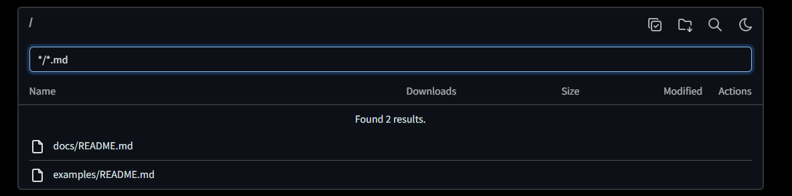

# Search & Sorting

Click on the column header to sort by that column. Click again to reverse the sort order.

Click on the search icon to open the search input field. Both `glob` and `regex` engines are available to search the current folder and all descendants of the current folder.

### Glob-based search

This is the recommended search engine for most users. It is simple to use and faster than the regex engine.

| Pattern        | Description                                                                                                                                |
|----------------|--------------------------------------------------------------------------------------------------------------------------------------------|
| `*`           | Matches zero or more characters.                                                                                                           |
| `?`           | Matches exactly one character (any character).                                                                                             |
| `[...]`       | Matches one character from a group of characters. If the first character is `!`, it matches any character *not* in the group.              |
| `\`           | Escapes the following character.                                                             |

[Learn more](https://en.wikipedia.org/wiki/Glob_(programming))

### Regex-based search

[Learn more](https://en.wikipedia.org/wiki/Regular_expression)

import EnvConfig from '@site/src/components/EnvConfig';

<EnvConfig name="SEARCH|SEARCH_ENGINE|SEARCH_MAX_DEPTH|SEARCH_MAX_RESULTS|REVERSE_SORT" init="true|glob|25|100|false" values="true,false|glob,regex|integer|integer|true,false" versions="3.7|3.7|3.7|3.7|1.0" desc="Enables or disables the search functionality|Search engine to evaluate query|Maximum recursive search depth (regex engine only)|Maximum number of results in a single request|By default files and folders are sorted by name using natural sort."/>