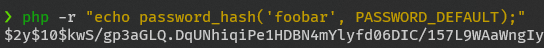
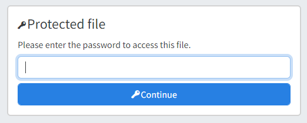

import Image from "@theme/IdealImage";

# Password Protection

Individual files can be protected with a password.
It is also possible to protect the entire dir-browser instance with a global password.

Both file passwords and a global password can be used at the same time.

## File password

<Image img={require("@site/static/img/pw1.png")} />

A file can be protected with a password, which is stored in a [dbmeta.json](/configuration/metadata.md) file.

Protected files can only be downloaded/viewed after unlocking them with the correct password. However, they are still visible in the file tree.

Protected files will display a key icon next to their name in the file tree.

### Definition

See [Metadata](metadata.md) for more information on how to define metadata for a file.

:::info
At this time, only files can be protected with a password, not directories. This may change in the future.
:::

#### Hash

The hash should be generated using PHP's [`password_hash`](https://www.php.net/manual/en/function.password-hash.php) function.
You can generate one using the following command or use an online generator.
```bash
php -r "echo password_hash('foobar', PASSWORD_DEFAULT);"
```




```json title="/examples/pwhash protected.txt.dbmeta.json"
{
  "password_hash": "$2y$10$kwS/gp3aGLQ.DqUNhiqiPe1HDBN4mYlyfd06DIC/157L9WAaWngIy"
}
```

#### Plaintext

```json title="/examples/foo bar/bla bla.txt.dbmeta.json"
{
  "password": "foobar"
}
```

:::warning
Do not specify both `password` and `password_hash`.
:::


### Access

#### Via UI

When accessing a protected file, you will be prompted to enter the password.

https://dir-demo.adriansoftware.de/examples/foo%20%20%20bar/bla%20bla.txt

{/* <Image img={require("@site/static/img/pw2.png")} /> */}


#### GET request

Specify the password as a `key` parameter in the URL:

https://dir-demo.adriansoftware.de/examples/foo%20%20%20bar/bla%20bla.txt?key=foobar

#### POST request

Or as part of a POST request

```
curl -X POST https://dir-demo.adriansoftware.de/examples/foo%20%20%20bar/bla%20bla.txt -d "key=foobar"
```

## Global password

The entire dir-browser instance can be protected with a global password using [basic auth](https://en.wikipedia.org/wiki/Basic_access_authentication). 

### Definition

import EnvConfig from '@site/src/components/EnvConfig';

<EnvConfig name="PASSWORD_USER|PASSWORD_RAW|PASSWORD_HASH" init="<empty>|<empty>|<empty>" values="<string>|<string>|<hash>" desc="Username|Plaintext password|Hash of a password. See definition above." versions="3.3|3.3|3.3"/>

:::warning
`PASSWORD_USER` and either `PASSWORD_RAW` or `PASSWORD_HASH` is mandatory to specify.
:::

{/* :::info
Support for LDAP, OAuth, and other authentication methods is planned.
:::

support Basic Auth */}

### Access

#### Via UI

When accessing the dir-browser, your browser will prompt you to enter a username and password.

#### GET request

Specify the `username:password` pair base64 encoded in the `Authorization` header.

For example if the username is `admin` and the password is `foobar` then Base64 encode `admin:foobar` to `YWRtaW46Zm9vYmFy`.

```
curl https://dir-demo.adriansoftware.de/examples/burger.jpg -H "Authorization: Basic YWRtaW46Zm9vYmFy"
```

#### POST request

Or as part of a POST request

```
curl -X POST https://dir-demo.adriansoftware.de/examples/burger.jpg -H "Authorization: Basic YWRtaW46Zm9vYmFy"
```
